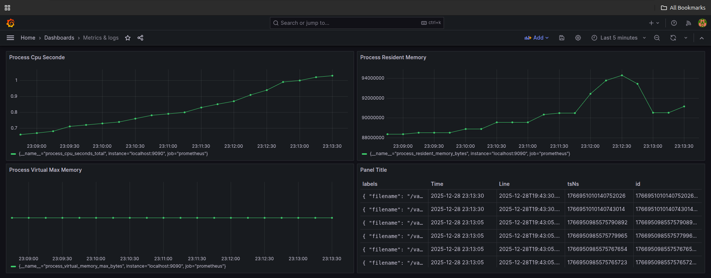

# Kubernetes Monitoring Stack (Prometheus, Grafana, Loki, Alloy)

This project sets up a complete monitoring stack on Kubernetes using:

Prometheus – Metrics collection

Grafana – Visualization & dashboards

Loki – Log aggregation

Grafana Alloy – Metrics & logs agent


The stack is fully deployed using Kubernetes manifests and ConfigMaps, without Helm.


---

## 📁 Project Structure

monitoring-k8s/
├── k8s/
│   ├── namespace.yaml
│   ├── prometheus/
│   │   ├── deployment.yaml
│   │   ├── service.yaml
│   │   ├── configmap.yaml
│   │   └── alerts.yml
│   ├── grafana/
│   │   ├── deployment.yaml
│   │   ├── service.yaml
│   │   ├── configmap-datasources.yaml
│   │   └── configmap-dashboards.yaml
│   ├── loki/
│   │   ├── deployment.yaml
│   │   ├── service.yaml
│   │   └── configmap.yaml
│   └── alloy/
│       ├── deployment.yaml
│       └── configmap.yaml
└── README.md


---

## 🧱 Components Overview

### 🔹 Prometheus

Scrapes metrics from Alloy

Stores metrics

Loads alert rules via alerts.yml


### 🔹 Grafana

Uses provisioning via ConfigMaps

Automatically loads:

Datasources (Prometheus & Loki)

Dashboards (JSON files)


### 🔹 Loki

Stores logs sent from Alloy


### 🔹 Grafana Alloy

Collects:

Node metrics

Process metrics

Kubernetes container logs


Forwards:

Metrics → Prometheus

Logs → Loki


---

## ⚙️ Deployment Steps

1️⃣ Create Namespace
```bash
kubectl apply -f k8s/namespace.yaml
```

---

2️⃣ Deploy Prometheus
```bash
kubectl apply -f k8s/prometheus/
```
Includes:

ConfigMap

Deployment

Service

Alert rules


---

3️⃣ Deploy Loki
```bash
kubectl apply -f k8s/loki/
```

---

4️⃣ Deploy Grafana
```bash
kubectl apply -f k8s/grafana/
```
Grafana uses:

grafana-datasources-provisioning ConfigMap

grafana-dashboards-provisioning ConfigMap


Dashboards and datasources are loaded automatically on startup.


---

5️⃣ Deploy Alloy
```bash 
kubectl apply -f k8s/alloy/
```
Alloy configuration includes:

Prometheus exporter

Loki file log source

Remote write targets


---

## 📊 Grafana Access

Port-forward Grafana:
```bash
kubectl port-forward -n monitoring svc/grafana 3000:3000
```
Open in browser:

http://localhost:3000

Default credentials:

Username: admin

Password: admin


---

## 📈 Metrics Examples

Available metrics in Grafana / Prometheus:

process_cpu_seconds_total

node_memory_MemAvailable_bytes

node_cpu_seconds_total

container_cpu_usage_seconds_total


---

## 📸 Screenshots

> 📷 Grafana Dashboard Screenshot
(Add your dashboard screenshot here)


Example after adding image:




---

## 🚨 Alerts (Prometheus)

Alert rules are defined in:

k8s/prometheus/alerts.yml

Loaded via:

rule_files:
  - /etc/prometheus/alerts/*.yml


---

## 🧠 Key Learnings

Kubernetes monitoring without Helm

Grafana provisioning using ConfigMaps

Alloy configuration for metrics & logs

Prometheus alerting

Debugging CrashLoopBackOff & ConfigMap mounts


---

## 🧪 Tested Environment

Kubernetes (local cluster)

Grafana 10.x

Prometheus latest

Loki latest

Grafana Alloy


---

## 📌 Future Improvements

Alertmanager with Email notifications

Helm-based deployment

Persistent volumes

TLS & authentication

More dashboards


